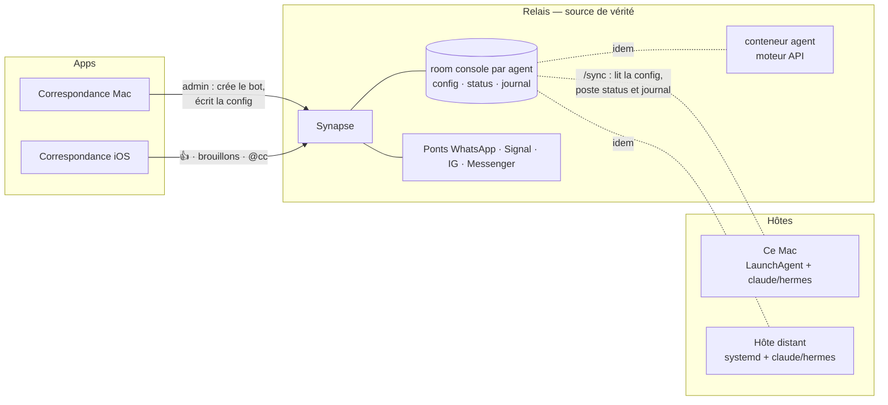

# Plan — Des agents dans l'inbox, en local et en cloud

Contexte : `docs/AGENT.md` (ce qui marche), ADR 0001 (le Relais est la source de vérité), `docs/PRODUCT.md` § « Révision iOS » (horizon agents).
Règle héritée du produit : **chaque décision doit rester valable si un tiers installe l'app un jour.** C'est précisément le test que le dispositif actuel ne passe pas.

---

## Où on en est (état réel, 2026-09-01)

- Un agent = un utilisateur Matrix (`@cc`, `@hermes`) piloté par `correspondance-agent`, sur le NUC, en `systemd --user`. Un moteur par bot (`claude` ou `hermes`), lancé en sous-processus sur l'abonnement de la machine.
- Ce qui vit **sur l'hôte** : `config.json` écrit à la main (mot de passe du bot, owners, trigger, outils, permissions, liaisons room→dépôt), l'état (token, sessions, position de sync), le service.
- Ce qui vit **sur le Relais** : le mode brouillon/voix haute (account data, réglé depuis le Mac), le status des moteurs (event dans la note à soi), les propositions et les demandes de permission (events que les ponts ignorent).
- Ce que l'app sait faire : lire le status, régler le mode, inviter cc dans un fil, rendre une proposition en brouillon. Elle ne sait ni créer un bot, ni le configurer, ni le lancer. La demande de permission n'a pas encore de 👍 dans l'app.

Conséquence : pour un tiers, « avoir cc » = un serveur Linux, Docker, SSH, un compte Matrix créé à la main, un fichier JSON. Ce n'est pas un bouton, c'est un week-end.

---

## Les questions à trancher

Chaque question a une recommandation. Les décisions qui n'appartiennent qu'à meffysto sont dans la dernière section.

### Q1. Où tourne l'agent ?

Trois topologies, pas une. Elles ne s'excluent pas : un même utilisateur peut avoir `cc` sur son Mac et `hermes` sur un serveur.

| Topologie | Ce que ça demande | Force | Limite |
|---|---|---|---|
| **Ce Mac** — l'app embarque `correspondance-agent` et l'installe en LaunchAgent (`SMAppService`) | rien : `claude` est déjà connecté sur le Mac | le seul vrai « un clic » ; l'abonnement de l'utilisateur, aucune clé | s'endort avec le Mac ; répond depuis là où l'app est installée |
| **Hôte distant** — NUC, VPS, Raspberry : un binaire Linux/macOS + un service | un shell une fois (SSH), un moteur connecté sur cet hôte | 24/7, Mac fermé ; c'est le montage actuel | l'app ne peut pas tout faire : une commande à coller, un `claude login` à faire là-bas |
| **Le Relais lui-même** — un conteneur `agent` livré avec Synapse et les ponts | un moteur qui n'a pas besoin de session interactive (API) | 24/7 sans machine de plus ; installable avec le Relais | pas d'abonnement : coût au jeton ; secret d'API à loger quelque part |

**Recommandation.** Faire de l'*hôte* un objet de premier rang dans l'app (« Réglages › Agents › Hôtes ») avec ces trois types, et **commencer par « Ce Mac »** : c'est le seul chemin qui rend le bouton possible pour un tiers sans rien lui demander. Le NUC reste le chemin de meffysto, désormais *assisté* plutôt qu'artisanal. Le conteneur Relais vient avec le moteur API (Q4).

### Q2. D'où l'agent tient-il sa configuration ?

Aujourd'hui de son hôte. C'est le nœud : tant que la vérité est dans un fichier sur une machine, l'app ne peut pas « aller chercher les configs ». Et ça contredit l'ADR 0001.

**Recommandation : le Relais est la source de vérité de l'agent aussi.** Concrètement, une **room console** par agent, créée par l'app, où il n'y a que le propriétaire et le bot :

- la configuration est un **event d'état** `fr.correspondance.agent.config` (owners, déclencheur, moteur, politique d'outils, mode par défaut, liaisons room→dossier, plafond) — écrit par l'app, lu par l'agent au démarrage et à chaque `/sync` ; un changement dans les réglages est appliqué sans redémarrage ;
- le status, le journal des tours et des permissions accordées y sont postés (ce que l'agent poste déjà dans la note à soi, mais chez lui) ;
- un secret d'API, s'il y en a un (Q4), y va aussi *ou* reste sur l'hôte — question ouverte n° 3.

Il ne reste **sur l'hôte que l'amorce** : `homeserver`, `user`, `password` — trois lignes, que l'app peut générer, afficher, ou écrire elle-même quand l'hôte est le Mac. C'est ça, « la config auto ».

Pourquoi une room et pas l'account data du bot : l'app est connectée comme le propriétaire, elle ne peut pas écrire dans l'account data d'un autre utilisateur. Une room, si : le propriétaire y a le pouvoir, le bot y lit.

### Q3. Qui est l'agent ?

Un utilisateur Matrix par agent, comme aujourd'hui — c'est ce qui le rend invitable, mentionnable, visible dans « cc a rejoint », et relayable par les ponts.

**Provisionnement.** L'app est déjà administrateur Synapse (elle appelle `/_synapse/admin/…/make_room_admin`). Elle peut donc **créer le compte** du bot (`PUT /_synapse/admin/v2/users/@cc:…`) avec un mot de passe qu'elle génère, sans jamais changer les sessions existantes (`logout_devices: false` — sinon un clic sur le Mac tue l'agent du NUC). Le nom du bot est libre : `cc` par défaut, `hermes`, ou ce que l'utilisateur veut.

Ce que ça suppose : un Relais où l'utilisateur est admin — vrai pour quelqu'un qui a installé le Relais avec `infra/matrix/bootstrap.sh`, à vérifier dans l'app (`/_synapse/admin/v1/users/<moi>/admin`) avant de promettre quoi que ce soit.

### Q4. Quels moteurs, et comment ils se connectent ?

Deux familles, et elles ne se déploient pas pareil.

| Moteur | Nature | Ce Mac | Hôte distant | Conteneur Relais |
|---|---|---|---|---|
| `claude` (Claude Code) | CLI, abonnement, session interactive une fois | ✅ déjà connecté | ✅ `claude login` en SSH, une fois | ⚠️ possible, fragile |
| `hermes` | CLI, sa propre config et sa propre mémoire | ✅ | ✅ | ⚠️ |
| `codex`, `gemini`… | CLI, même contrat `AgentBackend` | ✅ | ✅ | ⚠️ |
| **API** (Claude Agent SDK / Messages API + outils) | pas de session : une clé | ✅ | ✅ | ✅ |

**Recommandation.** Garder les CLI comme moteurs « à abonnement » (c'est l'idée fondatrice : jamais de clé quand on a l'abonnement) et **ajouter un moteur API** pour le cas cloud — c'est lui qui rend le conteneur Relais viable. Le scan des moteurs (`doctor`) tourne sur l'hôte et remonte par le status ; l'app affiche, par hôte, ce qui est prêt et ce qu'il manque, avec la marche à suivre (« ouvre un terminal sur le NUC et lance `claude login` »).

### Q5. Permissions et sécurité

Ce qui existe : owners seuls, invitation par un propriétaire seulement, plafond horaire, pas de relecture de l'historique, liste blanche d'outils, demande dans la room + 👍 (agent OK, app pas encore), brouillon devant des tiers.

**À faire.**
- **Trois paliers d'outils** plutôt qu'une liste brute, réglés depuis l'app par agent : *Lire* (Read/Grep/Glob/Web), *Écrire* (+ Edit/Write dans le dossier lié), *Exécuter* (+ Bash). Tout ce qui déborde du palier est demandé dans la room. Les listes exactes vivent dans `AgentConfig.Presets`, versionnées.
- **Le 👍 dans l'app** (iOS + Mac) : la demande de permission rendue comme une carte avec deux boutons, pas une réaction à trouver. Sans ça, dans une room avec un tiers, la question est invisible.
- **Un dossier par room, jamais `~`** par défaut : le `cwd` de l'agent est un dossier dédié (`~/Correspondance/cc/<room>`) tant qu'on n'a pas lié un dépôt.
- **Secrets** : mot de passe du bot dans le Trousseau sur le Mac, `0600` sur un hôte ; jamais dans une room sauf décision explicite (question ouverte n° 3).
- **Journal** : chaque tour (qui, quoi, outils, durée) posté dans la room console — relisible depuis l'iPhone.
- **E2EE** : un agent est un utilisateur ; dans une room chiffrée il faudrait qu'il soit un *appareil* avec ses clés. Hors périmètre tant que le Relais n'est pas chiffré (décision produit existante), à noter pour ne pas se fermer la porte.

### Q6. Comment l'agent vit dans l'inbox ?

L'agent est un correspondant, pas un panneau. Ce qui suit fait la différence entre « un bot » et « quelqu'un dans la conversation ».

- **L'appeler** : `@cc` en autocomplétion comme un membre (fait sur iPhone), et une action « Demander à cc » sur un message (contexte = le message cité).
- **Le voir travailler** : « écrit… » (fait), puis **réponse progressive** — `claude -p --output-format stream-json` permet d'éditer le message au fil de l'eau plutôt que d'attendre trente secondes de silence.
- **Le laisser durer** : un tour long devient un *travail* — une bulle qui dit « en cours, 2 min » avec « Arrêter », un résultat qui arrive plus tard, une notification. Techniquement un event `fr.correspondance.agent.job` mis à jour par édition.
- **Lui donner des choses** : une photo, un fichier, un vocal (transcrit) dans le prompt. Le tour reçoit les pièces jointes du message et de la citation.
- **Décider pour lui** : brouillon → Envoyer/Modifier/Ignorer (fait sur Mac, à faire sur iPhone) ; carte de permission (Q5).
- **Le régler sans aller loin** : dans la fiche du fil, « cc répond ici : à voix haute / en brouillon » et « dossier lié ».

### Q7. Mémoire

Par room, via `--resume` (fait). Manque : ce que cc sait *d'une personne* d'une room à l'autre, et une mémoire qui survit au changement d'hôte. Recommandation : un fichier de mémoire par correspondant, versionné dans la room console (event d'état par contact), injecté dans le prompt système du tour. Hermes a la sienne ; on ne la double pas.

### Q8. Un tiers, concrètement

Ce que « un autre utilisateur a les agents » suppose, dans l'ordre : un Relais (Synapse + ponts) qu'il a installé ou qu'on lui héberge → l'app connectée en admin → **un clic** dans Réglages › Agents. Les phases 2 et 4 rendent le clic réel dans les deux cas (Mac, Relais). Ce que le plan ne couvre pas : héberger le Relais pour quelqu'un — question ouverte n° 1.

### Q9. Observabilité

`doctor` (fait), status au démarrage (fait), journal systemd. À ajouter : le status porte le **nom de l'hôte** et l'heure (« cc tourne sur umbrel depuis 14 h 02 »), un status à chaque *arrivée* dans une room (pas seulement au démarrage — sans ça un bot invité après coup reste muet dans les réglages), un « Tester » dans l'app qui envoie `@cc ping` dans la room console et mesure.

---

## Architecture cible

Une seule règle : **l'agent ne sait de lui-même que son amorce ; tout le reste, il le lit sur le Relais**, d'où qu'il tourne.

---

## Phases

Chaque phase se termine par un build vert, un test de bout en bout (`scripts/agent-e2e.sh` étendu) et un commit. L'ordre est celui de la valeur : après la phase 2, un tiers a un agent en un clic.

### Phase 0 — Solder ce qui traîne (1–2 jours)
- Carte de permission avec 👍/👎 sur iPhone et Mac (l'event `fr.correspondance.agent.permission`).
- Status avec nom d'hôte, et status à chaque arrivée dans une room.
- Paliers d'outils (`AgentConfig.Presets`) ; le NUC passe au palier *Exécuter* avec permission (fait à la main aujourd'hui — à formaliser).
- **Sortie** : depuis l'iPhone, un `@cc mkdir …` pose une carte, le 👍 débloque, Réglages dit « cc tourne sur umbrel ».

### Phase 1 — La room console : la config vient du Relais (2–3 jours)
- `AgentEvents.configType`, schéma versionné ; l'agent lit l'état au démarrage et le suit au `/sync` ; l'hôte ne garde que l'amorce.
- L'app crée la room console à la première activation, y écrit la config, y lit status et journal. Le réglage brouillon/voix haute y migre (l'account data reste lue en repli une version).
- Migration du NUC : `config.json` → amorce + room ; `rooms` (liaisons) reprises.
- **Sortie** : changer le palier d'outils dans Réglages prend effet sur le NUC sans SSH ni redémarrage.

### Phase 2 — Hôte « Ce Mac », un clic (2–3 jours)
- Cible xcodegen `correspondance-agent` (outil macOS) embarquée dans `Contents/MacOS` ; plists `Contents/Library/LaunchAgents/app.correspondance.agent-<nom>.plist` ; `SMAppService` (état, approbation dans Éléments d'ouverture, désactivation).
- `correspondance-agent run --agent <nom>` : le dossier d'amorce se déduit du nom (`~/.correspondance-<nom>`), un journal `agent.log` à côté — un plist statique ne connaît pas `~`.
- Provisionnement : vérification admin → création/reset du compte (`logout_devices: false`) → amorce écrite, mot de passe au Trousseau → service → invitation dans la room console et la note à soi.
- Réglages › Agents refondu : une carte par agent (`cc` · Claude, `hermes` · Hermes, « Ajouter… »), moteur trouvé sur ce Mac et sa version, état du service, dernier status, boutons Activer / Désactiver / Tester.
- **Sortie** : sur un Mac vierge avec `claude` connecté et l'app admin du Relais, « Activer cc » → `@cc ping` répond en moins d'une minute, sans terminal.

### Phase 3 — Hôte distant assisté (2 jours)
- Binaire Linux et macOS publié en release (le build Docker de `infra/agent/deploy.sh` devient un artefact).
- « Ajouter un hôte distant » dans l'app : elle crée le compte, génère l'amorce et affiche **une commande à coller** (`curl … | sh -s -- <jeton d'amorce>`) qui installe le binaire, écrit l'amorce, pose le service (systemd ou launchd). Le jeton est à usage unique, périmé en 10 min.
- Aide au moteur : le status dit « claude absent / non connecté sur cet hôte », l'app affiche quoi lancer.
- **Sortie** : le NUC est réinstallé par ce chemin, sans `deploy.sh`.

### Phase 4 — Moteur API et conteneur Relais (3–4 jours)
- `APIBackend` : Claude Agent SDK (ou Messages API + outils Read/Write/Bash équivalents), même contrat `AgentBackend`, mêmes permissions par spool.
- Service `agent` dans `infra/matrix/docker-compose.yml`, amorce par jeton d'inscription, clé d'API par variable d'environnement (ou room console — question ouverte n° 3).
- Dans l'app : hôte « Le Relais », activable si le conteneur répond (il poste un status « prêt, sans moteur » dès l'installation).
- **Sortie** : un utilisateur sans Mac allumé et sans NUC a un `cc` 24/7, facturé au jeton.

### Phase 5 — Un correspondant, pas un bot (continu)
Réponse progressive, travaux longs, pièces jointes dans le prompt, « Demander à cc » sur un message, brouillons sur iPhone, mémoire par correspondant. Chaque item est indépendant et livrable seul.

---

## Risques

- **`SMAppService` et Éléments d'ouverture** : macOS peut exiger une approbation ; il faut la montrer, pas l'espérer. À éprouver tôt (phase 2, premier jour).
- **Deux agents sur le même compte** (Mac + NUC activés tous les deux) : ils répondraient deux fois. La room console porte « qui tourne » ; l'app refuse d'activer un hôte si un autre a posté un status il y a moins de deux minutes, et le dit.
- **Le `PATH` d'un LaunchAgent** est vide : la recherche des moteurs doit être la nôtre (`~/.local/bin`, `/opt/homebrew/bin`, `~/.claude/local` — à ajouter).
- **Sessions `--resume`** liées à l'hôte : changer d'hôte, c'est perdre la mémoire de la room. Acceptable si dit ; la mémoire par correspondant (Q7) répare le fond.
- **Coût API** sans garde-fou : plafond horaire *et* plafond de jetons par jour dans la config, affichés dans l'app.

---

## Questions ouvertes — à trancher par meffysto

1. **Le tiers, c'est qui ?** Quelqu'un qui installe son propre Relais (le plan suffit), ou quelqu'un à qui *tu* héberges un Relais (il faut alors un multi-tenant du côté Synapse et des ponts — un autre plan) ?
2. **L'API, oui ou non ?** Le moteur API ouvre le cloud mais introduit un coût au jeton et une clé à garder. Sans lui, « cloud » veut dire « un hôte distant avec `claude login` » — déjà très bien pour des gens techniques.
3. **Où vit un secret d'API ?** Variable d'environnement sur l'hôte (sûr, pas « un clic ») ou room console (un clic, mais en clair dans la base du Relais) ?
4. **Hermes en première classe, ou « moteur CLI générique »** (une commande modèle, un parseur de sortie) dans lequel Hermes n'est qu'un préréglage ? Le second est plus court à maintenir si `codex` et `gemini` suivent.
5. **Plusieurs propriétaires** (un foyer, deux Mac) : un agent par personne, ou un agent partagé avec deux owners ? La room console le permet ; l'UX, pas encore.
